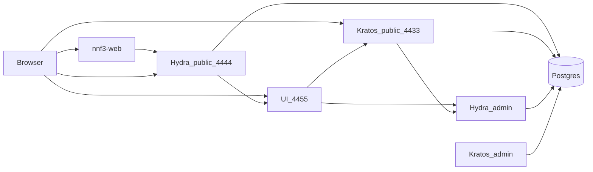

# アーキテクチャ

認証（この人は誰か）は Kratos、認可（このアプリに何を許すか）は Hydra です。自社アプリは Hydra だけを OIDC プロバイダとして見ます。



## コンポーネント

| コンポーネント | 責務 | 設定 |
|---|---|---|
| Hydra | OAuth 2.0 / OIDC 認可サーバー。token 発行。ユーザーを持たない | [config/hydra/hydra.yml](../config/hydra/hydra.yml) |
| Kratos | identity、パスワード、確認、リカバリ | [config/kratos/kratos.yml](../config/kratos/kratos.yml) |
| UI | ログイン / 登録 / 同意 / 設定の画面 | `compose.yaml` の `ui` |
| Postgres | Kratos 用 DB と Hydra 用 DB を分離 | [config/postgres/init.sql](../config/postgres/init.sql) |
| Mailslurper | ローカルの確認メール受信 | `compose.yaml` の `mailslurper` |

イメージは Kratos / Hydra / UI とも `v26.2.0` です。

## URL の二系統

ホスト名は混ぜません。`localhost` ではなく `127.0.0.1` に統一しています。

**ブラウザから見える URL**

| 用途 | URL |
|---|---|
| Hydra issuer / `/oauth2/*` / discovery | `http://127.0.0.1:4444` |
| ログイン / 同意 / ログアウト UI | `http://127.0.0.1:4455` |
| Kratos public（ブラウザが cookie を送る先） | `http://127.0.0.1:4433` |
| 自社アプリ callback（sample-web） | `http://127.0.0.1:3000/callback` |

**コンテナ間だけ**

| 用途 | URL |
|---|---|
| Kratos → Hydra Admin（login accept） | `http://hydra:4445` |
| UI → Kratos Public（サーバサイド） | `http://kratos:4433` |
| UI → Hydra Admin（consent） | `http://hydra:4445` |
| UI → Kratos Admin | `http://kratos:4434` |

Hydra の発行者はブラウザ向けです。コンテナ名にすると discovery の `issuer` とトークンが一致しません。

```11:16:config/hydra/hydra.yml
urls:
  self:
    issuer: http://127.0.0.1:4444
  login: http://127.0.0.1:4455/login
  consent: http://127.0.0.1:4455/consent
  logout: http://127.0.0.1:4455/logout
```

Kratos は Hydra Admin をコンテナ名で呼びます。

```16:18:config/kratos/kratos.yml
oauth2_provider:
  url: http://hydra:4445
  override_return_to: true
```

Admin ポート（Hydra `:4445`、Kratos `:4434`）はローカル確認用です。GCP では公開しません。

## 自社クライアント `nnf3-web`

作成は [scripts/create-first-party-client.sh](../scripts/create-first-party-client.sh) です。

| 項目 | 値 |
|---|---|
| client_id | `nnf3-web` |
| 種別 | public（`token-endpoint-auth-method: none`）+ PKCE |
| grant | `authorization_code`, `refresh_token` |
| scope | `openid`, `offline`, `offline_access`, `email`, `profile` |
| redirect_uri | `http://127.0.0.1:3000/callback` |
| consent | skip（Hydra `--skip-consent` と UI の `TRUSTED_CLIENT_IDS`） |

## トークン

Hydra のアクセストークンは opaque です。検証は introspection（`POST /admin/oauth2/introspect` または public の introspection）です。Refresh token も opaque です。ID Token だけ JWT です。

```31:32:config/hydra/hydra.yml
strategies:
  access_token: opaque
```

## Identity

スキーマは [config/kratos/identity.schema.json](../config/kratos/identity.schema.json) です。

- `traits.email` — 必須。パスワード識別子、確認、リカバリに使う
- `traits.name.first` / `traits.name.last` — 任意

OIDC の `sub` は Kratos の identity id です。メールは変わり得るので、アプリ側の主キーにはしません。
