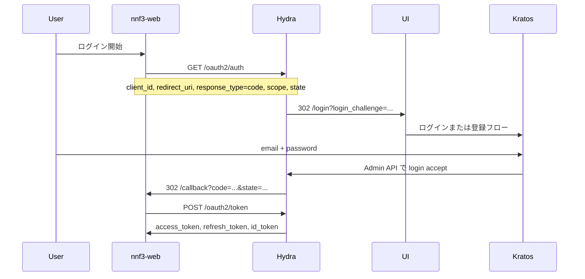

# 認証・認可フロー

自社アプリは Hydra を OIDC プロバイダとして使います。ログイン画面とユーザー管理は Kratos です。

## 1. 認可コード + ログイン（主経路）

RFC 6749 の Authorization Code Grant です。認証だけ Kratos に委譲します。`nnf3-web` は first-party なので同意画面は出しません。



認可開始:

```
http://127.0.0.1:4444/oauth2/auth?client_id=nnf3-web&redirect_uri=http://127.0.0.1:3000/callback&response_type=code&scope=openid%20offline%20email%20profile&state=localdev
```

| パラメータ | 役割 |
|---|---|
| `response_type=code` | Authorization Code を使う |
| `client_id` | `nnf3-web` |
| `redirect_uri` | 登録済みと完全一致必須 |
| `scope` | `openid` で ID Token、`offline` で refresh token |
| `state` | CSRF 対策。戻り値を照合する |

流れの要点:

1. Hydra が未認証なら `urls.login`（`/login?login_challenge=...`）へ送る
2. UI が Kratos のブラウザログイン（または登録）を開始する。challenge が付く
3. Kratos は `oauth2_provider.url` 経由で Hydra Admin を呼び、login を accept する
4. 自社クライアントなので consent はスキップする
5. Hydra が `redirect_uri?code=...&state=...` に戻す
6. アプリが `POST http://127.0.0.1:4444/oauth2/token` でトークンに交換する（PKCE）

`apps/sample-web` が `http://127.0.0.1:3000/callback` で code を受け取り、`POST /oauth2/token` で交換します。code が付いていれば IdP 側は成功です。code は一度しか使えないので、受け側が落ちていたあとに同じ callback URL を再読み込みしても交換できません。

## 2. 登録・確認・リカバリ

Hydra を通さない経路もあります。UI から直接 Kratos の self-service を使います。

| フロー | UI | 設定 |
|---|---|---|
| 登録 | `/registration` | password 成功後に `session` hook |
| ログイン | `/login` | lifespan 10m |
| メール確認 | `/verification` | `use: code`、courier → Mailslurper |
| リカバリ | `/recovery` | `use: code` |
| 設定 | `/settings` | パスワード変更など |

OIDC の途中で未登録なら、同じ UI で登録したあと `login_challenge` 付きで Hydra に戻ります。確認メールは http://127.0.0.1:4436 です。登録直後は session hook でログイン状態になるため、確認前でも認可は先に進みます。

## 3. ログアウト

Hydra の `urls.logout` は UI の `/logout` です。UI が Kratos セッションを破棄し、`default_browser_return_url`（`/login`）へ戻します。

アプリから OIDC の RP-initiated logout（`/oauth2/sessions/logout`）を呼ぶのは、アプリ実装後です。

## 4. トークンの使い方（アプリ側）

ローカルでは `apps/sample-web` がトークン交換まで行います。本番の自社アプリでも同じです。

| トークン | 形式 | 使い方 |
|---|---|---|
| Access token | opaque | 自社 API へ `Authorization: Bearer`。検証は Hydra introspection |
| Refresh token | opaque | 期限切れ後に `/oauth2/token`。ブラウザや API には送らない |
| ID Token | JWT | アプリがユーザーを識別する。`sub` は Kratos identity id |

Discovery は `http://127.0.0.1:4444/.well-known/openid-configuration` です。
